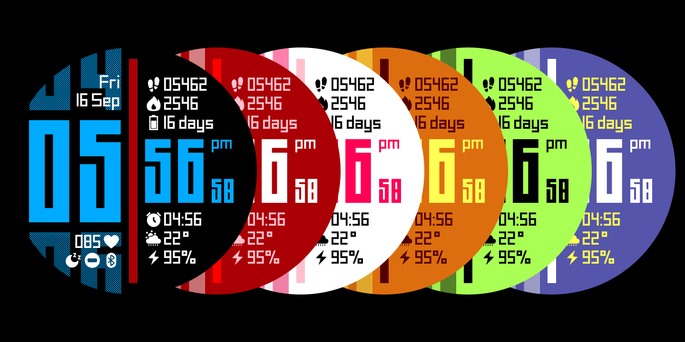

# Simple Pixels Watch Face for Garmin

[Watch Face on Garmin IQ Store](https://apps.garmin.com/en-US/apps/21034069-9d2e-4c91-a365-e640bf6fa7b2)

[The mockup in Figma here](https://www.figma.com/design/S4uiLF7jpq9vPhYVuVB9v0/%5BShared%5D-Simple-Pixels-(Garmin-Watchface)?m=auto&t=3xz538FcJpVMS9Lc-1)

## Simple Pixels - A Minimalist Garmin Watch Face

Simple Pixels is a minimalist watch face that aims to include as many metrics as possible while maintaining a clean and minimal pixel style. It also fetches weather data from the OpenWeather service (settings accessible from your phone).

**Note:** Changing the watch face settings is only available on your watch!

This watch face was inspired by Premier, which unfortunately stopped supporting newer Garmin models. I decided to create my own version with a fresh design and full metric support.

This is a personal project intended to be fun and educational. It will **always** be free. If you enjoy it, please leave a review and rating to support its development!

**Want to buy me a coffee?**  [Ko-fi link](https://ko-fi.com/shimbabu)

## Technical Features and Goals

I wanted to make the design as modular as possible, breaking it down into reusable services, modules, components, and specific implementations. I'm happy with the result, which focuses on low memory and battery consumption to support even older Garmin watches.

Initial development and testing in the emulator didn't reveal the need for optimization in data and cache storage. In fact, on real devices, optimizing for storage reduced battery life and didn't improve rendering speed. I found that direct data requests and full re-rendering were much faster than trying to be "smart" about updates.

To reduce memory usage (and support devices like the Fenix 5), I reworked some services for speed and efficiency. This makes the storage service and others look different from my initial plan, but it significantly reduced memory consumption.

The settings page was a challenge. It runs alongside the watch face, preventing resource cleanup, which is bad for low-memory devices. To stay under the 100KB limit, I rebuild pages and reuse loaded resources, freeing them when leaving the page.

Overall, the design balances optimization and system design for flexibility and modularity while minimizing resource usage.

### Lessons from the Garmin SDK

* Storing data and entities in memory doesn't help performance (it actually hurts).
* Storing loaded resources in memory consumes less than loading them each time.
* Unload resources immediately when they're not needed.
* Watch face resources aren't freed when the settings screen opens.
* For ideal performance on older devices, memory usage in the debugger shouldn't exceed 72KB for the watch face and 97KB with settings open.
* The createBufferedBitmap pattern works better but isn't available on older devices.

### Future Plans

I wanted to add more screens and AMOLED support, but the resource management and manual adjustments needed due to poor export quality are frustrating. I'm open to pull requests if anyone can help with this!

## Changelog

### v1.2.5

* Updated SDK to version 7.3.1.
* Released on GitHub.

### v1.2.4

* Retrieve Open Weather data every 5 minutes if the previous request failed. 

### v1.2.3

* Fixed issue with weather display from OpenWeather.

### v1.2.2

* Further optimizations for older watch generations.
* Fixed settings display issue on older watches.

### v1.2.1

* Fixed resource caching issue.
* Fixed English language date display.

### v1.2.0

Huge thanks for the feedback and patience. With your help, I identified and addressed performance issues on older devices:

* Significant optimization, especially for older devices.
* Optimized initial watch face loading.
* Optimized drawing algorithm for semi-transparent elements.
* Updated SDK to version 6.2.0.
* Other minor optimizations.

### v1.1.9

* Another attempt to fix the error on old devices; gathered more information from a user.

### v1.1.8

* Testing a bug fix for older devices.

### v1.1.7

* Disabled resource caching for old devices (Fenix 6X Pro and below) to potentially fix the bug. Please let me know if this helps!

### v1.1.6

* Minor optimization and small improvements.

### v1.1.5

* Fixed distance display issues.
* Optimized for faster and more stable performance.

### v1.1.4

* Performed some optimizations.

### v1.1.3

* Removed option grouping in the mobile app settings menu due to unsaved settings and critical errors (a known issue with no fix from Garmin).

### v1.1.2

* Fixed bugs affecting location accuracy for OpenWeather data retrieval.

### v1.1.1

* Added support for Fenix 7 pro, Fenix 7s pro, Fenix 7x pro watches.
* Added experimental OpenWeather data fetching (settings accessible from the phone). Please report any issues encountered. 